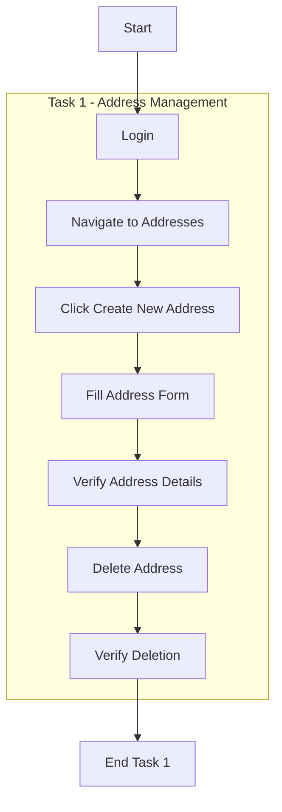

# Web Automation Testing Project - Address Management

## Project Overview Task 1
This automation testing framework tests the address management functionality of MyStore TestLab using Selenium WebDriver with Java. The project follows the Page Object Model (POM) design pattern and uses Cucumber for BDD testing.

## What is BDD (Behavior Driven Development)?
BDD is a way of writing tests in plain English that everyone can understand - not just programmers. It follows a simple pattern:

- **Given**: The initial context (e.g., "Given I'm on mystore main page")
- **When**: An action takes place (e.g., "When I sign in with email and password")
- **Then**: The expected outcome (e.g., "Then the address data should be correct")

Example from project:

```gherkin
Given I'm on mystore main page
When I sign in with email 'bla@gmail.com' and password 'blabla123'
And I click on addresses tile
And I click Create new address
Then the address data should be correct
```

This approach helps:
- Non-technical team members understand test scenarios
- Developers know exactly what to implement
- Testers have clear acceptance criteria
- Documentation stays up-to-date with actual tests

## Test Flow Diagram



## Project Structure

```
src/
├── test/
│ ├── java/
│ │ ├── pages/
│ │ │ ├── AuthenticationPage.java
│ │ │ ├── AddressesPage.java
│ │ │ ├── MyAccountPage.java
│ │ │ └── NewAddressPage.java
│ │ ├── steps/
│ │ │ ├── AddressSteps.java
│ │ │ └── AddressStepsTest.java
│ │ └── features/
│ │ └── my_store_addresses.feature
│ └── resources/
│ └── chromedriver
└── pom.xml
```

### Page Objects
Located in `src/test/java/pages/`:

#### 1. AuthenticationPage
- Handles user login functionality
- Key methods:
  - `loginAs(email, password)`: Performs login with provided credentials
  - `getLoggedUsername()`: Retrieves and verifies logged-in username

#### 2. MyAccountPage
- Manages navigation in user account section
- Key methods:
  - `ClickAddressesTile()`: Navigates to addresses section by clicking the addresses tile

#### 3. AddressesPage
- Handles address list operations
- Key methods:
  - `clickCreateNewAddress()`: Initiates new address creation process
  - `deleteAddress()`: Removes existing address
  - `isAddressDeleted()`: Verifies successful deletion message

#### 4. NewAddressPage
- Manages address form operations
- Key methods:
  - `fillNewAddressForm(alias, address, city, postalCode, country, phone)`: Completes all address form fields
  - `isAddressAddedSuccessfully()`: Verifies successful address addition message

### Test Implementation

#### Steps Definition (`AddressSteps.java`)
- Contains Cucumber step definitions for address management
- Key steps implemented:
  - Browser initialization and configuration
  - Login process
  - Address creation workflow
  - Address verification
  - Address deletion
  - Success message verification
  - Browser cleanup

#### Test Runner (`AddressStepsTest.java`)
- Configures Cucumber test execution
- Specifies feature file location and step definitions
- Generates HTML test reports

### Feature File (`my_store_addresses.feature`)
Complete scenario with examples:
```gherkin
Feature: MyStore Address Management

  Scenario Outline: Adding new address with verification
    Given I'm on mystore main page
    When I sign in with email '<email>' and password '<password>'
    And I click on addresses tile
    And I click Create new address
    And I fill the address form with '<alias>', '<address>', '<city>', '<postalCode>', '<country>', '<phone>'
    Then the address data should be correct for '<alias>', '<address>', '<city>', '<postalCode>', '<country>', '<phone>'
    When I delete the address
    Then I can see success message "Address successfully deleted!"
    And I close mystore browser

    Examples:
      | email          | password  | alias | address         | city   | postalCode | country         | phone     |
      | bla@gmail.com | blabla123 | Home  | Avenida Marconi | Lisbon | 100-205    | United Kingdom  | 254598524 |
```

## Key Design Decisions

1. **Page Object Model (POM)**
   - Separates test logic from page interactions
   - Makes tests more maintainable and reusable
   - Reduces code duplication

2. **WebDriver Management**
   - Centralized driver initialization
   - Consistent window maximization
   - Implicit wait implementation for better stability

3. **Form Interaction**
   - Click-clear-sendKeys pattern for reliable form filling
   - Explicit element location strategies
   - Robust error handling

4. **Verification Methods**
   - Clear success message verification
   - Comprehensive address data validation
   - Reliable element presence checks

## Dependencies
- Selenium WebDriver: Browser automation
- Cucumber: BDD testing framework
- JUnit: Test execution and assertions
- Chrome WebDriver: Browser driver

## Running Tests
1. Ensure Chrome WebDriver is installed
2. Run `AddressStepsTest.java` as JUnit test
3. Check generated reports in `target/cucumber-report.html`

## Best Practices Used
- Descriptive method names
- Clear page object structure
- Robust element locators
- Proper wait strategies
- Comprehensive scenario coverage
- Clean test data management

## Future Improvements
- Add negative test scenarios
- Enhance error reporting
